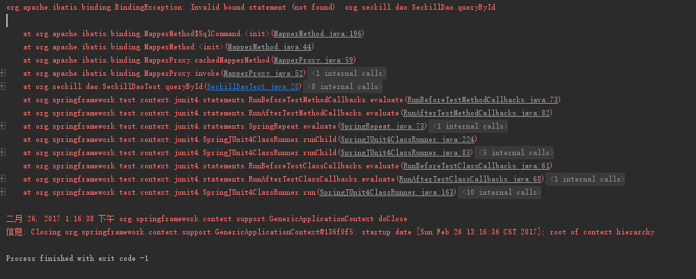
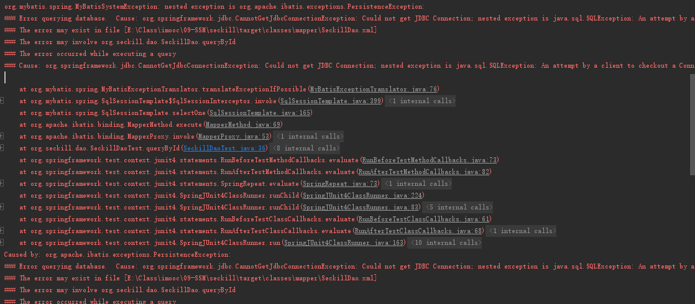

# Java高并发秒杀API之业务分析与DAO层
> 官网地址
> - logback配置：https://logback.qos.ch/manual/configuration.html；
> - spring配置：http://docs.spring.io/spring/docs；
> - mybatis配置：http://mybatis.github.io/mybatis-3/zh/index.html

## 一、创建项目和依赖
### 1. maven命令创建web骨架项目
```
mvn archetype:generate -DgroupId=org.seckill -DartifactId=seckill -DarchetypeArtifactId=maven-archetype-webapp
``` 
### 2. IDEA配置项目
- 选中项目的pom.xml，导入项目；
- 更改web.xml的约束；
- 补全目录：File-->Project Structure下，Project Settings-->modules；

### 3. 设置依赖项：pom.xml
``` xml
  <dependencies>
    <dependency>
      <groupId>junit</groupId>
      <artifactId>junit</artifactId>
      <version>4.11</version>
      <scope>test</scope>
    </dependency>
  <!-- 1:日志 java日志：sl4j,log4j,logback,common-logging
      sl4g 是规范/接口；
      日志实现：log4j，logback,common-logging
      使用：sl4j + logback
   -->
    <dependency>
      <groupId>org.slf4j</groupId>
      <artifactId>slf4j-api</artifactId>
      <version>1.7.12</version>
    </dependency>
    <dependency>
      <groupId>ch.qos.logback</groupId>
      <artifactId>logback-core</artifactId>
      <version>1.1.1</version>
    </dependency>
    <!-- 实现slf4j接口并整合 -->
    <dependency>
      <groupId>ch.qos.logback</groupId>
      <artifactId>logback-classic</artifactId>
      <version>1.1.1</version>
    </dependency>

    <!-- 2.数据库相关的依赖 -->
    <dependency>
      <groupId>mysql</groupId>
      <artifactId>mysql-connector-java</artifactId>
      <version>5.1.35</version>
      <scope>runtime</scope>
    </dependency>
    <dependency>
      <groupId>c3p0</groupId>
      <artifactId>c3p0</artifactId>
      <version>0.9.1.2</version>
    </dependency>
    <!-- DAO框架：MyBatis依赖 -->
    <dependency>
      <groupId>org.mybatis</groupId>
      <artifactId>mybatis</artifactId>
      <version>3.3.0</version>
    </dependency>
    <!-- MyBatis与Spring整合依赖 -->
    <dependency>
      <groupId>org.mybatis</groupId>
      <artifactId>mybatis-spring</artifactId>
      <version>1.2.3</version>
    </dependency>

    <!-- 3.Servlet web相关依赖 -->
    <dependency>
      <groupId>taglibs</groupId>
      <artifactId>standard</artifactId>
      <version>1.1.2</version>
    </dependency>
    <dependency>
      <groupId>jstl</groupId>
      <artifactId>jstl</artifactId>
      <version>1.2</version>
    </dependency>
    <dependency>
      <groupId>com.fasterxml.jackson.core</groupId>
      <artifactId>jackson-databind</artifactId>
      <version>2.5.4</version>
    </dependency>
    <dependency>
      <groupId>javax.servlet</groupId>
      <artifactId>javax.servlet-api</artifactId>
      <version>3.1.0</version>
    </dependency>

    <!-- 4.Spring依赖 -->
    <!-- Spring核心依赖 -->
    <dependency>
      <groupId>org.springframework</groupId>
      <artifactId>spring-core</artifactId>
      <version>4.1.7.RELEASE</version>
    </dependency>
    <dependency>
      <groupId>org.springframework</groupId>
      <artifactId>spring-beans</artifactId>
      <version>4.1.7.RELEASE</version>
    </dependency>
    <dependency>
      <groupId>org.springframework</groupId>
      <artifactId>spring-context</artifactId>
      <version>4.1.7.RELEASE</version>
    </dependency>
    <!-- spring dao层依赖-->
    <dependency>
      <groupId>org.springframework</groupId>
      <artifactId>spring-jdbc</artifactId>
      <version>4.1.7.RELEASE</version>
    </dependency>
    <dependency>
      <groupId>org.springframework</groupId>
      <artifactId>spring-tx</artifactId>
      <version>4.1.7.RELEASE</version>
    </dependency>
    <!-- spring web 相关依赖 -->
    <dependency>
      <groupId>org.springframework</groupId>
      <artifactId>spring-web</artifactId>
      <version>4.1.7.RELEASE</version>
    </dependency>
    <dependency>
      <groupId>org.springframework</groupId>
      <artifactId>spring-webmvc</artifactId>
      <version>4.1.7.RELEASE</version>
    </dependency>
    <!-- spring test相关 -->
    <dependency>
      <groupId>org.springframework</groupId>
      <artifactId>spring-test</artifactId>
      <version>4.1.7.RELEASE</version>
    </dependency>
  </dependencies>
```

## 二、秒杀业务分析
### 1. 秒杀业务的核心——库存的处理
**用户针对库存业务分析**
```
[减库存]
              }--> 组成完整的事务--> 数据落地
[记录购买明细]
```
> 即数据的落地需要事务的支持（目前的NoSQL还不能对事务很好的支持，所以本例中用关系型数据库MySQL）。

### 2. 秒杀业务实现难点——如何高效处理“竞争”
> MySQL处理“竞争”的问题——事务+行级锁
#### 事务
- Start Transaction
- **Uudate 库存数量**（“竞争”出现的地方）
- Insert 购买明细
- Commit
#### 行级锁
``` sql
update table set num=num-1 where id=10 and num>1
```
多个用户同时执行该操作时，就会出现等待

### 3. 秒杀功能
- 秒杀接口暴露
- 执行秒杀
- 相关查询

## 三、数据库编码工作
数据库初始化脚本
``` sql
-- 创建数据库
CREATE DATABASE seckill;
-- 使用数据库
use seckill;
-- 创建秒杀库存表
CREATE TABLE seckill(
  `seckill_id` BIGINT NOT NULL AUTO_INCREMENT COMMENT '商品库存id',
  `name` VARCHAR(120) NOT NULL COMMENT '商品名称',
  `number` INT NOT NULL COMMENT '库存数量',
  `start_time` TIMESTAMP NOT NULL COMMENT '秒杀开始时间',
  `end_time` TIMESTAMP NOT NULL COMMENT '秒杀结束时间',
  `create_time` TIMESTAMP NOT NULL  DEFAULT CURRENT_TIMESTAMP COMMENT '创建时间',
  PRIMARY KEY (seckill_id),
  KEY idx_start_time(start_time),
  KEY idx_end_time(end_time),
  KEY idx_create_time(create_time)
)ENGINE=InnoDB AUTO_INCREMENT=1000 DEFAULT CHARSET=utf8 COMMENT '秒杀库存表';

-- 初始化数据
INSERT INTO
  seckill(name,number,start_time,end_time)
VALUES
  ('1000元秒杀iPhone6',100,'2017-11-01 00:00:00','2017-11-02 00:00:00'),
  ('500元秒杀iPad2',200,'2017-11-01 00:00:00','2017-11-02 00:00:00'),
  ('300元秒杀小米四',300,'2017-11-01 00:00:00','2017-11-02 00:00:00'),
  ('200元秒杀红米note',400,'2017-11-01 00:00:00','2017-11-02 00:00:00');

-- 秒杀成功明细表
-- 用户登录认证相关的信息
CREATE TABLE success_killed(
  `seckill_id` BIGINT NOT NULL COMMENT '秒杀商品id',
  `user_phone` BIGINT NOT NULL COMMENT '用户手机号',
  `state` TINYINT NOT NULL DEFAULT -1 COMMENT '状态标示：-1:无效 0:成功 1:已付款',
  `create_time` TIMESTAMP NOT NULL COMMENT '创建时间',
  PRIMARY KEY (seckill_id,user_phone), /* 联合主键 */
  KEY idx_create_time(create_time)
)ENGINE=InnoDB DEFAULT  CHARSET=utf8 COMMENT '秒杀成功明细表';
```

## 四、DAO层实体和接口编码
### 1. 编写实体类
### 2. 编写DAO层接口
### 3. 基于MyBatis实现DAO接口
官方中文文档：http://www.mybatis.org/mybatis-3/zh/index.html
#### 1. 创建MyBatis全局配置文件：mybatis-config.xml
从官方文档获取约束
``` xml
<?xml version="1.0" encoding="UTF-8" ?>
<!DOCTYPE configuration
        PUBLIC "-//mybatis.org//DTD Config 3.0//EN"
        "http://mybatis.org/dtd/mybatis-3-config.dtd">
<configuration>
    <!-- 配置全局属性 -->
    <settings>
        <!-- 使用jdbc的getGeneratedKeys 获取数据库自增主键 -->
        <setting name="useGeneratedKeys" value="true"/>
        <!-- 使用列别名替换列明 默认：true -->
        <setting name="useColumnLabel" value="true"></setting>
        <!-- 开启驼峰命名转换 -->
        <setting name="mapUnderscoreToCamelCase" value="true"></setting>
    </settings>

</configuration>
```

#### 2. 创建mapper目录，放值关系映射的文件
SeckillDao.xml
``` xml
<?xml version="1.0" encoding="UTF-8" ?>
<!DOCTYPE mapper
        PUBLIC "-//mybatis.org//DTD Mapper 3.0//EN"
        "http://mybatis.org/dtd/mybatis-3-mapper.dtd">
<mapper namespace="org.seckill.dao.SeckillDao">
    <!-- 目的：为DAO接口方法提供sql语句配置 -->

    <update id="reduceNumber">
        <!-- 具体的sql -->
        UPDATE
          seckill
        SET
          number = number - 1
        WHERE seckill_id = #{seckillId}
        AND start_time <![CDATA[ <= ]]> #{killTime}
        AND end_time >= #{killTime}
        AND number > 0;
    </update>

    <!-- 因为开启了列别名替换列名，此处就不用`as`的语法了 -->
    <select id="queryById" resultType="Seckill">
        SELECT seckill_id,name,number,start_time,end_time,create_time
        FROM seckill
        WHERE seckill_id = #{seckillId}
    </select>

    <!-- 返回值如果是List的话，resultType写泛型值 -->
    <select id="queryAll" resultType="Seckill">
        SELECT seckill_id,name,number,start_time,end_time,create_time
        FROM seckill
        ORDER BY create_time DESC
        limit #{offset},#{limit}
    </select>
</mapper>
```
SuccessKilledDao.xml
``` xml
<?xml version="1.0" encoding="UTF-8" ?>
<!DOCTYPE mapper
        PUBLIC "-//mybatis.org//DTD Mapper 3.0//EN"
        "http://mybatis.org/dtd/mybatis-3-mapper.dtd">
<mapper namespace="org.seckill.dao.SuccessKilledDao">
    <!-- sql技巧：主键冲突，insert语句会报错，添加ignore则主键冲突的时候回忽略错误，返回0 -->
    <insert id="insertSuccessKilled">
        INSERT ignore INTO success_killed(seckill_id,user_phone,state)
        VALUES (#{seckillId},#{userPhone},0);
    </insert>

    <select id="queryByIdWithSeckill" resultType="SuccessKilled">
        <!-- 根据ID查询SuccessKilled并携带秒杀产品对象实体 -->
        <!-- 如何告诉mybatis把结果映射到Successkilled实体，同时映射Seckill实体 -->
        <!-- mybatis可以自由控制SQL -->
        SELECT
          sk.seckill_id,
          sk.user_phone,
          sk.create_time,
          sk.state,
          s.seckill_id "seckill.seckill_id",
          s.name "seckill.name",
          s.number "seckill.number",
          s.start_time "seckill.start_time",
          s.end_time "seckill.end_time",
          s.create_time "seckill.create_time"
        FROM success_killed sk
        INNER JOIN seckill s ON sk.seckill_id = s.seckill_id
        WHERE sk.seckill_id=#{seckillId} AND sk.user_phone=#{userPhone};
    </select>
</mapper>
```
> sql技巧：主键冲突，insert语句会报错，添加ignore则主键冲突的时候回忽略错误，返回0；

## 五、MyBatis整合Spring
整合目标
- 更少的代码：只写接口，不写实现类
- 更少的配置：包扫描，配置扫描，dao实现
- 足够的灵活性

### 1. 创建spring目录，存放spring相关的配置
spring官方文档： http://docs.spring.io/spring/docs/4.1.7.RELEASE/spring-framework-reference/。
#### 1. 文档中找到Container overview，找到xml的约束。
``` xml
<?xml version="1.0" encoding="UTF-8"?>
<beans xmlns="http://www.springframework.org/schema/beans"
       xmlns:xsi="http://www.w3.org/2001/XMLSchema-instance"
       xmlns:context="http://www.springframework.org/schema/context"
       xsi:schemaLocation="http://www.springframework.org/schema/beans
 http://www.springframework.org/schema/beans/spring-beans.xsd http://www.springframework.org/schema/context http://www.springframework.org/schema/context/spring-context.xsd">

</beans>
```
#### 2. 配置整合mybatis过程：spring-dao.xml
1. 配置数据库相关参数
在resources下新建文件jdbc.properties
```
driver=com.mysql.jdbc.Driver
url=jdbc:mysql://127.0.0.1:3306/seckill?useUnicode=true&characterEncoding=utf8&useSSL=true
user=root
password=root
```
在spring-dao.xml中引入
``` xml
<context:property-placeholder location="classpath:jdbc.properties"/>
```

2. 配置数据库连接池
``` xml
    <bean id="dataSource" class="com.mchange.v2.c3p0.ComboPooledDataSource">
        <!-- c3p0连接池，配置连接池属性 -->
        <property name="driverClass" value="${driver}"/>
        <property name="jdbcUrl" value="${url}"/>
        <property name="user" value="${user}"/>
        <property name="password" value="${password}"/>

        <!-- 连接池的私有属性 -->
        <property name="maxPoolSize" value="30"/>
        <property name="minPoolSize" value="10"/>
        <!-- 关闭连接后不自动commit -->
        <property name="autoCommitOnClose" value="false"/>
        <!-- 获取连接超时时间 -->
        <property name="checkoutTimeout" value="1000"/>
        <!-- 当获取连接失败时，重试次数 -->
        <property name="acquireRetryAttempts" value="2"/>
    </bean>
```

3. 配置SqlSessionFactory对象（MyBatis与Spring整合的重要配置）
约定大于配置
``` xml
    <bean id="sqlSessionFactory" class="org.mybatis.spring.SqlSessionFactoryBean">
        <!-- 注入数据库连接池 -->
        <property name="dataSource" ref="dataSource"/>
        <!-- 配置MyBatis全局配置文件：mybatis-config.xml -->
        <property name="configLocation" value="classpath:mybatis-config.xml"/>
        <!-- 扫描entity包，使用别名 org.seckill.entity.Seckill -->
        <property name="typeAliasesPackage" value="org.seckill.enerty"/>
        <!-- 扫描sql配置文件：mapper需要的xml文件 -->
        <property name="mapperLocations" value="classpath:mapper/*.xml"/>
    </bean>
```

4. 配置扫描DAO接口，动态实现DAO接口，注入到spring容器中
``` xml
    <bean class="org.mybatis.spring.mapper.MapperScannerConfigurer">
        <!-- 注入sqlSessionFactory -->
        <property name="sqlSessionFactoryBeanName" value="sqlSessionFactory"/>
        <!-- 给出需要扫描DAO接口包 -->
        <property name="basePackage" value="org.seckill.dao"/>
    </bean>
```

## 六、DAO层单元测试
1. 选择要测试的dao类，按alt+enter-->create test
选择jUnit4,并勾选相应方法，确认即可。
2. 添加注解
``` java
// 配置spring和Junit整合，junit启动是加载springIOC容器
@RunWith(SpringJUnit4ClassRunner.class)
// 告诉junit spring配置位置
@ContextConfiguration("classpath:spring/spring-dao.xml")
```
注入SeckillDao或SuccessKilledDao
``` java
// 注入Dao实现类依赖
    @Resource
    private SeckillDao seckillDao;
```
3. 我的错误
**测试queryById方法的错误**
```
org.apache.ibatis.binding.BindingException: Invalid bound statement (not found): org.seckill.dao.SeckillDao.queryById
```


**原因：**
SeckillDao.java中方法名与SeckillDao.xml中的ID配置不一致（一个为queryById，一个为queryId），将文件的对应名称改为一致即可。

``` 
org.mybatis.spring.MyBatisSystemException: nested exception is org.apache.ibatis.exceptions.PersistenceException: 
### Error querying database.  Cause: org.springframework.jdbc.CannotGetJdbcConnectionException: Could not get JDBC Connection; nested exception is java.sql.SQLException: An attempt by a client to checkout a Connection has timed out.
### The error may exist in file [E:\Class\imooc\09-SSM\seckill\target\classes\mapper\SeckillDao.xml]
### The error may involve org.seckill.dao.SeckillDao.queryById
### The error occurred while executing a query
### Cause: org.springframework.jdbc.CannotGetJdbcConnectionException: Could not get JDBC Connection; nested exception is java.sql.SQLException: An attempt by a client to checkout a Connection has timed out.
```


**原因：**
jdbc.properties中，username这个属性会被系统的username变量覆盖，所以spring-dao中传入的是错误的username。
**解决方法：**
将username换为其他值，比如user、uName... 

**测试queryAll方法的错误**
```
org.mybatis.spring.MyBatisSystemException: nested exception is org.apache.ibatis.binding.BindingException: Parameter 'offset' not found. Available parameters are [0, 1, param1, param2]
```
**原因：**
java没哟保存形参的记录，即queryAll(int offset, int limit) --> queryAll(arg0, arg1)
**解决：**
给参数添加注解@Param：List<Seckill> queryAll(@Param("offset") int offset, @Param("limit") int limit);