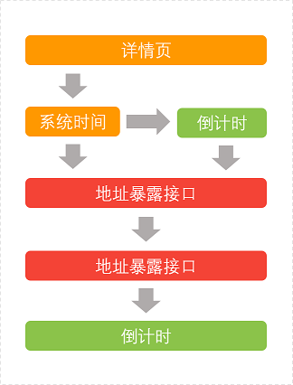
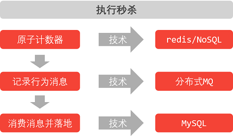
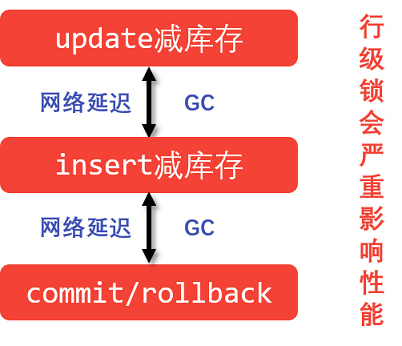
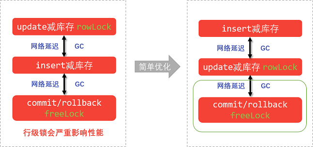
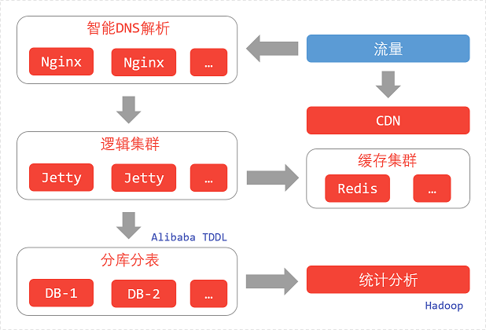

# java高并发秒杀API之并发优化
## 一、高并发优化分析



- 不是绿色的模块都是会发生高并发操作；
- 主要需要改善的是红色的模块。
 
### 1. CDN（内容分发网络）
- 加速用户获取数据的系统；
- 部署在离用户最近的网络节点上；
- 命中CDN不需要访问后端服务器；
- 互联网公司自己搭建或租用。

### 2. 其他方案分析



- 成本高（运维成本，保证NoSQL，MQ的正常运行）；
- 幂等性难保证（重复秒杀问题）；
- 不适合新手。

### 3. 瓶颈分析
1. 行级锁在commit/rollback之后释放



> **优化方向：减少行级锁持有时间**

2. 如何判断Update更新数据库成功
- Update自身无错；
- 客户端确认Update影响记录数，确保库存数量大于1；

3. 优化思路
把客户端逻辑放到MySQL服务端，避免网络延迟和GC影响。

4. 解决方案
- 定制SQL方案：update /* + [auto_commit] */，修改MySQL源码；
- 使用存储过程：整个事务在MySQL端完成。

### 4. 高并发优化总结
1. 前端控制：秒杀暴露接口，按钮防重复；
2. 动静态数据分离：CDN缓存（缓存静态资源），后端缓存（Redis）；
3. 实物竞争：减少事务所时间。


## 二、使用redis优化“地址暴露接口”
> redis作为一个数据库缓存，来减少数据库的访问，提高响应速度

### 1. 引入redis客户端——jedis
pom.xml
``` xml
        <dependency>
            <groupId>redis.clients</groupId>
            <artifactId>jedis</artifactId>
            <version>2.7.3</version>
        </dependency>
```

### 2. 引入序列化依赖——protpstuff
pom.xml
``` xml
        <dependency>
            <groupId>com.dyuproject.protostuff</groupId>
            <artifactId>protostuff-core</artifactId>
            <version>1.0.8</version>
        </dependency>
        <dependency>
            <groupId>com.dyuproject.protostuff</groupId>
            <artifactId>protostuff-runtime</artifactId>
            <version>1.0.8</version>
        </dependency>
```

### 3. 编写redis数据交互层：RedisDao.java
1. 使用构造方法注入：
``` java
    private final JedisPool jedisPool;

    public RedisDao(String ip, int port) {
        jedisPool = new JedisPool(ip, port);
    }
```

2. DAO配置：spring-dao.xml
``` xml
    <bean id="redisDao" class="org.seckill.dao.RedisDao">
        <constructor-arg index="0" value="localhost"/>
        <constructor-arg index="1" value="6379"/>
    </bean>
```

3. 定义序列化所用模式
``` java
    private RuntimeSchema<Seckill> schema = RuntimeSchema.createFrom(Seckill.class);
```
> 被模式化的类，如`Seckill.class`，都必须是POJO类（带有set、get方法）。

4. 操作redis
> 获取数据：jedis.get() `-->` byte[] `-->` 反序列化 `-->` Object(Seckill)；
> 添加数据：Object(Seckill) `-->` 序列化 `-->` byte[] `-->` jedis.setex()；

**获取数据**
``` java
    public Seckill getSeckill(long seckillId) {
        // redis操作逻辑
        try {
            Jedis jedis = jedisPool.getResource();
            try {
                String key = "seckill:" + seckillId;
                // 并没有实现内部序列化操作
                // get -> byte[] -> 反序列化 -> Object(Seckill)
                // 采用自定义序列化方式
                // protostuff：POJO.
                byte[] bytes = jedis.get(key.getBytes());
                if (bytes != null) {
                    Seckill seckill = schema.newMessage(); // 空对象
                    ProtostuffIOUtil.mergeFrom(bytes, seckill, schema);
                    // seckill 被反序列化
                    return seckill;
                }
            } finally {
                jedis.close();
            }
        } catch (Exception e) {
            logger.error(e.getMessage(), e);
        }
        return null;
    }
```

**添加数据**
``` java
    public String putSeckill(Seckill seckill) {
        // set Object(Seckill) -> 序列化 -> byte[]
        try {
            Jedis jedis = jedisPool.getResource();
            try {
                String key = "seckill:" + seckill.getSeckillId();
                byte[] bytes = ProtostuffIOUtil.toByteArray(seckill, schema, LinkedBuffer.allocate(LinkedBuffer.DEFAULT_BUFFER_SIZE));
                // 超时缓存
                int timeout = 60 * 60; // 一小时
                String result = jedis.setex(key.getBytes(), timeout, bytes);
                return result;
            } finally {
                jedis.close();
            }
        } catch (Exception e) {
            logger.error(e.getMessage(), e);
        }
        return null;
    }
```

## 三、秒杀操作——并发优化
### 1. 简单优化


> 目的：降低MySQL rowLock 的持有时间，将两倍的延时减为一倍；

### 2. 深度优化
> 事务SQL在MySQL端执行

**在MySQL中使用存储过程：**
1. 存储过程优化：优化的是事务行级锁持有的时间；
2. 不要过度依赖存储过程；
3. 简单的逻辑可以应用存储过程，比如示例中的逻辑；
4. QPS（每秒查询率）：可以达到一个秒杀单6000/QPS。

**项目中调用存储过程**
1. 创建接口方法：SeckillDao.java
``` java
void killByProcedure(Map<String, Object> paramMap);
```

2. 编写SQL语句：SeckillDao.xml
``` xml
    <!-- MyBatis调用存储过程 -->
    <select id="killByProcedure" statementType="CALLABLE">
        call execute_seckill(
          #{seckillId, jdbcType=BIGINT, mode=IN},
          #{phone, jdbcType=BIGINT, mode=IN},
          #{killTime, jdbcType=TIMESTAMP, mode=IN},
          #{result, jdbcType=INTEGER, mode=OUT}
        );
    </select>
```
> 因为要获取存储过程的返回值，所以参入的参数是Map；。

3. 调用执行：
获取存储过程的返回值需要添加commons-collections依赖：
``` xml
        <dependency>
            <groupId>commons-collections</groupId>
            <artifactId>commons-collections</artifactId>
            <version>3.2</version>
        </dependency>
```
SeckillServiceImpl.java
``` java
        Map<String, Object> map = new HashMap<String, Object>();
        map.put("seckillId", seckillId);
        map.put("phone", userPhone);
        map.put("killTime", killTime);
        map.put("result", null);

        try {
            seckillDao.killByProcedure(map);
            // 获取result，返回值
            int result = MapUtils.getInteger(map, "result", -2);
            if (result == 1) { ... ... } else { ... ... }
        } catch (Exception e) {
            ... ...
        }

```

## 四、大型系统部署
### 1. 可能用到的服务
1. CDN：内容分发网络
将静态资源发送到CDN后，降低服务器请求量。
- jQuery，BootStrap用公网提供的CDN；
- 项目编写的js，CSS，静态化的details.jsp都会推送到CDN。

2. WebServer：Nginx + Jetty
Nginx集群化的分布在多个服务器上，作为HTTP服务器和Servlet容器的反响代理；

3. Redis
作为服务器端的缓存

4. MySQL
MySQL事务，达到秒杀的一致性和完整性。

###2. 大型系统部署架构

