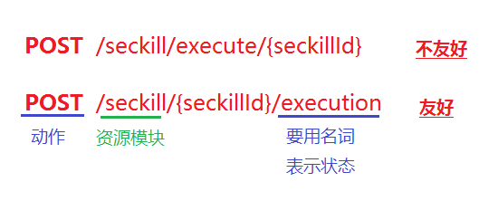
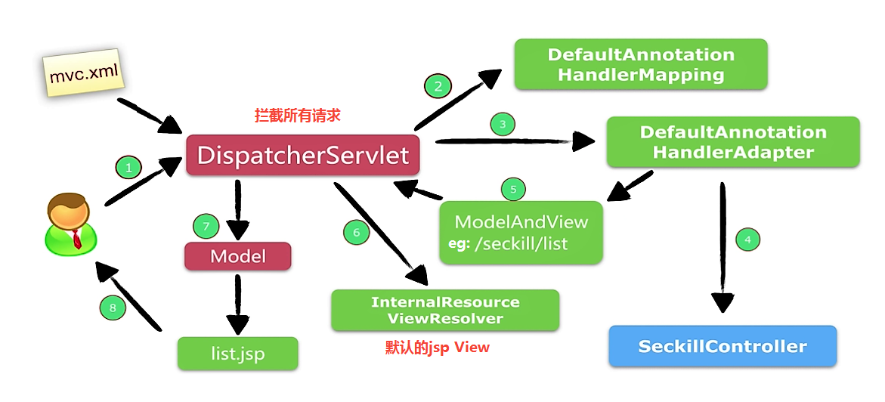
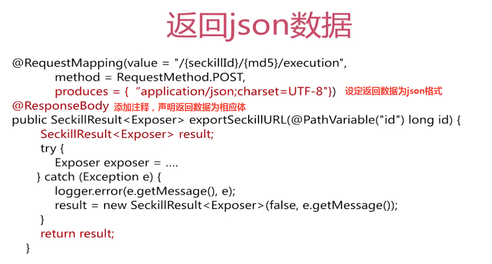
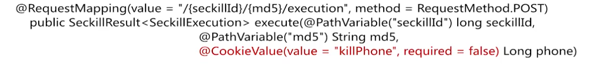
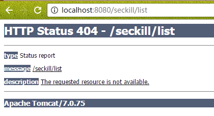

# java高并发秒杀API之web层
## 一、前端交互设计
### 1. 前端交互流程
**前端页面流程**
``` flow
st=>start: Start
op1=>operation: 列表页
op2=>operation: 详情页
cond=>condition: login?
op3=>operation: 登录操作
op4=>operation: 写入cookie
op5=>operation: 展示逻辑
e=>end
st->op1->op2->cond
cond(yes)->op5->e
cond(no)->op3->op4->op5->e
```
**详情页流程逻辑**
``` flow
st=>start: Start
op1=>operation: 获取标准系统时间
op2=>operation: 时间判断（开始时间/结束时间）
cond1=>condition: 秒杀是否结束?
cond2=>condition: 秒杀是否开始?
op3=>operation: 倒计时
op4=>operation: 秒杀结束
op5=>operation: 秒杀地址
op6=>operation: 执行秒杀
op7=>operation: 秒杀结果
e=>end
st->op1->op2->cond1
cond1(yes)->op4->e
cond1(no)->cond2
cond2(yes)->op5->op6->op7->e
cond2(no)->op3->op5
```

### 2.RESTful API设计
- 兴起于Rails；
- 一种优雅的URI标书方式
- 资源的状态和状态转移

**例子**



#### 1. RESTful规范
- GET：查询操作；
- POST：添加、修改操作（非幂等）；
- PUT：修改操作（幂等）；
- DELETE：删除操作

#### 2. URL设计
> /模块/资源/{表示}/集合1/...
> /user/{uid}/frienss   好友列表
> /user/{uid}/followers  关注者列表

#### 3. 秒杀API的URL设计
|URL                               | 获取资源|
|:--------------------------------|:-----------:|
|GET /seckill/list                 | 秒杀列表 |
|GET /seckill/{id}/detail          | 详情页   |
|GET /seckill/time/now             | 系统时间  |
|POST /seckill/{id}/exposer        |暴露秒杀接口|
|POST /seckill/{id}/{md5}/execution| 执行秒杀  |

## 二、Spring MVC
围绕Handler开发
Handler有两个产出：
- 数据Model
- 页面View

### 1. Spring MVC运行流程


### 2. 注解映射技巧
@RequestMaping注解
- 支持标准URL；
- Ant风格URL（带有`?` 和 `*`、`**`）；
- 带{XXX}占位符的URL。

### 3. 请求方法的技巧
**URL的访问**
- @PathVariable()注解注释占位符传入的参数；
- return "redirect:/path/..."：重定向；
- return "forward:/path/..."：转发；

**返回json数据**



**访问cookie**



- required=false，表示不强制传入，如果该cookie不存在则不传入。

## 三、整合Spring MVC框架
### 1. 配置DispatcherServlet：web.xml
``` xml
  <!-- 配置DispatcherServlet -->
  <servlet>
    <servlet-name>seckill-dispatcher</servlet-name>
    <servlet-class>org.springframework.web.servlet.DispatcherServlet</servlet-class>

    <!-- 配置springMVC需要加载的配置文件
        spring-dao.xml, spring-service.xml, spring-web.xml
        MyBatis -> spring ->springMVC
    -->
    <init-param>
      <param-name>contextConfigLocation</param-name>
      <param-value>classpath:spring/spring-*.xml</param-value>
    </init-param>
  </servlet>

  <!-- 默认匹配所有请求 -->
  <servlet-mapping>
    <servlet-name>seckill-dispatcher</servlet-name>
    <url-pattern>/</url-pattern>
  </servlet-mapping>
</web-app>
```

### 2. 配置Spring MVC：spring-web.xml
1. 开启SpringMVC注解模式，简化配置：
- 自动注册DefaultAnnotationHandlerMapping, AnnotationMethodHandlerAdapter；
- 提供一系列：数据绑定，数字和日期的format @NumberFormat, @DataTimeFormat, xml, json默认读写支持。

``` xml
<mvc:annotation-driven/>
```

2. 静态资源默认servlet配置
- 加入对静态资源的处理：js, gif, png
- 允许使用"/"桌整体映射

``` xml
<mvc:default-servlet-handler/>
```

3. 配置jsp 显示ViewResolver
``` xml
    <bean class="org.springframework.web.servlet.view.InternalResourceViewResolver">
        <property name="viewClass" value="org.springframework.web.servlet.view.JstlView"/>
        <property name="prefix" value="/WEB-INF/jsp"/>
        <property name="suffix" value=".jsp"/>
    </bean>
```

4. 扫描web相关的bean
``` xml
<context:component-scan base-package="org.seckill.web"/>
```

## 四、编写Controler
service和web层传递数据，需要编写DTO（数据传输对象）。

## 五、编写JSP

## 六、测试运行
### 1. Intellij IDEA安装Tomcat


### 2. 运行错误处理
1. index.jsp可以显示，但seckill/list报404错误


错误原因：可能是在Controler中设置URL映射除了错误
改正：检查@RequestMapping中URL的设置是否正确，访问路径和配置的URL是否一一对应。

2. 不识别EL表达式
```
According to TLD or attribute directive in tag file, attribute value does not accept any expressions
```
错误原因：没有正确导入JSTL包
改正：
```
<%@taglib prefix="c" uri="http://java.sun.com/jstl/core_rt" %>
<%@taglib prefix="fmt" uri="http://java.sun.com/jstl/fmt_rt"%>
```

## 七、交互逻辑
前端交互
javascript使用模块化编写
``` javascript
var seckill = {
	detail: {
		init: function(){ ... ... }
	}
}
```